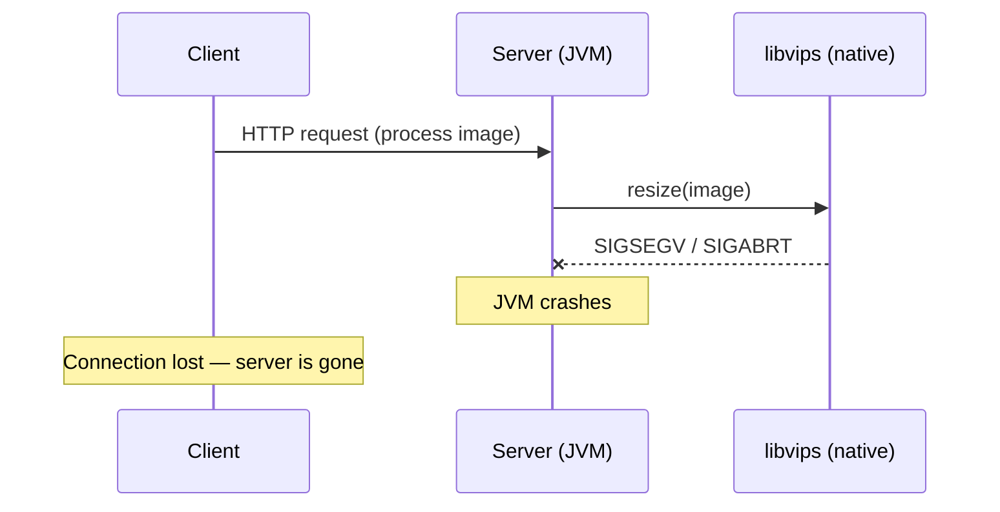
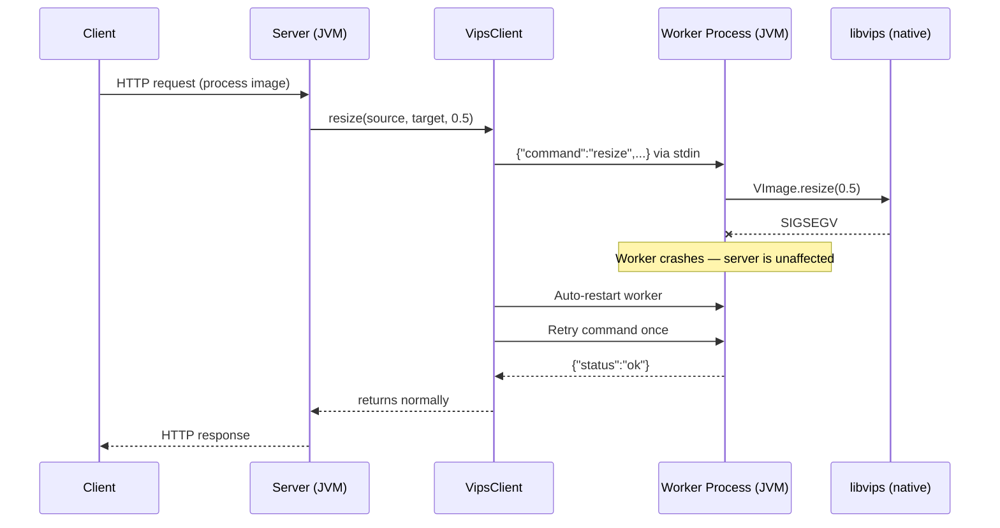
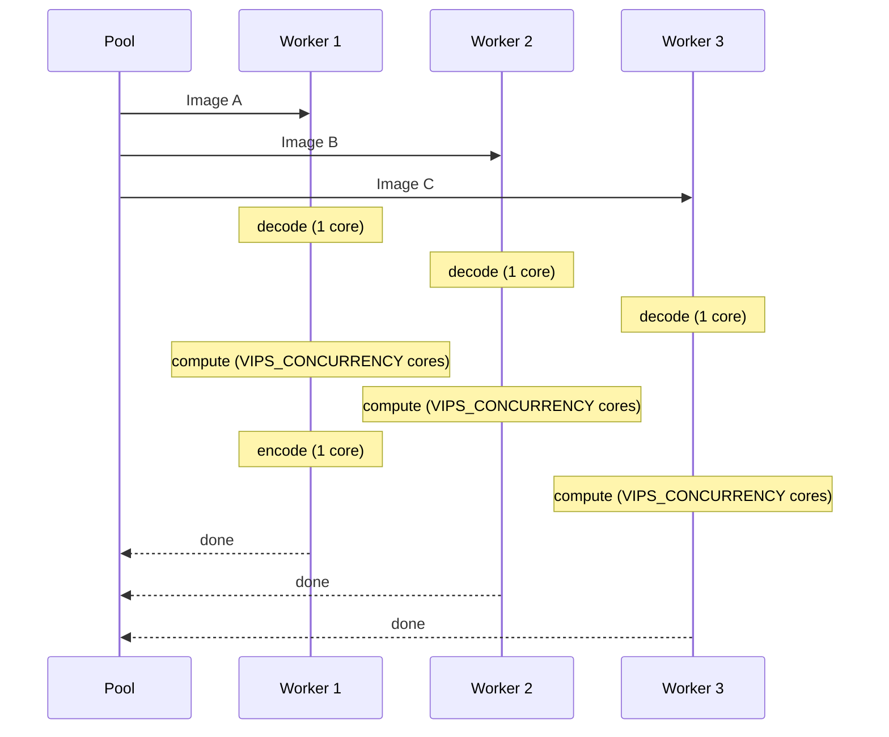
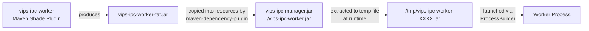
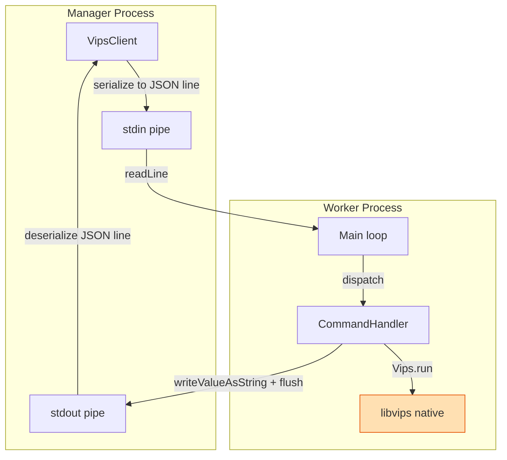

[](https://codecov.io/gh/sitepark/vips-ipc)
[](https://snyk.io/test/github/sitepark/vips-ipc/)

# vips-ipc

Inter-process communication wrapper for [libvips](https://www.libvips.org/) image processing, designed to protect
server applications from native library crashes.

## The Problem: Native Crashes in Server Processes

libvips is a high-performance image processing library written in C. When used from a Java server application via
[vips-ffm](https://github.com/lopcode/vips-ffm) (the Foreign Function & Memory API), all native code runs inside the
same JVM process as the server.

This creates a critical reliability problem:



A segmentation fault, abort signal, or heap corruption inside libvips terminates the entire JVM. Every concurrent
request fails. The server goes down. This is not a hypothetical edge case — broken input files, codec bugs, or
out-of-memory conditions in native libraries can and do trigger such crashes in production.

## The Solution: Isolation via IPC

vips-ipc moves all VIPS operations into a separate worker process. The server communicates with it over **stdin/stdout
using a line-based JSON protocol**. If the worker crashes, only that child process dies — the server process is
completely unaffected.



Key properties of this design:

- **Crash isolation**: A native crash in the worker cannot propagate to the server JVM
- **Auto-restart with retry**: If the worker dies, `VipsClient` automatically spawns a new one and retries the failed
  command once before throwing an exception
- **Thread-safe**: A `ReentrantLock` serializes all commands to the worker — safe to share across threads
- **Parallel throughput**: `VipsClientPool` manages N independent worker processes for multi-image parallelism — use
  `VipsClient.builder().buildPool(n)` when processing many images concurrently
- **Self-contained**: The worker JAR is embedded inside the manager JAR as a classpath resource; no external binary or
  installation is required

## Usage

```java
try (VipsClient client = VipsClient.builder().build()) {

  // Scale an image to 50%
  client.resize(
      Path.of("/var/images/input.jpg"),
      Path.of("/var/images/output.jpg"),
      0.5);

  // Create a thumbnail with fixed width (height proportional)
  client.thumbnail(
      Path.of("/var/images/input.jpg"),
      Path.of("/var/images/thumb.jpg"),
      320);
}
```

`VipsClient` implements `AutoCloseable`. Use it in a try-with-resources block or hold a single instance for the
lifetime of your application — both patterns are supported.

### Available Methods

| Method | Description |
|--------|-------------|
| `getEnvironment()` | Returns libvips version and available image format loaders |
| `configure(jpegInterlace, strip)` | Sets global encoding parameters; `null` keeps the current value. Defaults: progressive JPEG (`true`), strip metadata (`false`) |
| `resize(source, target, scale)` | Scales an image by factor (e.g. `0.5` = 50%) |
| `thumbnail(source, target, width)` | Creates a thumbnail with fixed width; height is proportional |
| `extract(source, colorsPaletteBitDepth)` | Extracts image metadata (dimensions, channels, alpha) and optionally a quantized color palette; pass `0` to skip palette extraction |
| `scaleTransform(source, target, resize, border, crop, background, formats, metadata)` | Applies resize → border → crop in sequence; writes one file per requested format using `target` as base path (without extension); steps are optional (`null` to skip) |
| `scaleTransformBatch(source, targets)` | Produces multiple outputs from one source image in a single worker call; image is loaded once using shrink-on-load |

### Extracting Image Metadata and Color Palette

`extract()` reads image metadata without writing any output file. It returns an `ExtractResult` with
the image dimensions, number of channels, and whether the image has an alpha channel. Optionally, it
quantizes the image into a compact color palette using GIF-based libimagequant quantization:

```java
ExtractResult result = client.extract(Path.of("/var/images/photo.jpg"), 5);

System.out.println(result.width());    // e.g. 3840
System.out.println(result.height());   // e.g. 2160
System.out.println(result.channels()); // e.g. 3 (RGB)
System.out.println(result.hasAlpha()); // e.g. false

ColorPalette palette = result.colorPalette();
for (ColorPaletteEntry color : palette.colors()) {
    System.out.printf("#%02X%02X%02X  %.1f%%%n",
        color.red(), color.green(), color.blue(), color.percentage());
}
```

The `colorsPaletteBitDepth` parameter controls how many palette slots are used during quantization
(`2^bitDepth` slots). A value of `5` gives 32 colors, which is a good balance between accuracy and
compactness. Pass `0` to skip palette extraction entirely — only the metadata fields are populated.

The palette colors are sorted by pixel coverage (descending), so `palette.colors().get(0)` is always
the dominant color of the image.

### Builder Options

```java
VipsClient client = VipsClient.builder()
    .javaExecutable("/usr/lib/jvm/java-25/bin/java")  // default: current JVM
    .jvmArgs(List.of("-Xmx512m"))                      // default: none
    .jarPath(Path.of("/opt/app/worker.jar"))            // default: embedded JAR
    .commandTimeoutMs(60_000)                           // default: 30 000 ms
    .concurrency(2)                                     // VIPS_CONCURRENCY per worker; default: 0 (all cores)
    .niceLevel(10)                                      // OS scheduling priority; default: 0 (no adjustment)
    .build();

// Pool: N independent worker processes for parallel throughput
VipsClientPool pool = VipsClient.builder()
    .concurrency(1)
    .niceLevel(10)
    .buildPool(Runtime.getRuntime().availableProcessors());
```

#### `niceLevel(int)`

Sets the OS scheduling priority of each worker process via `nice -n <value>`. Higher values lower the
priority (1–19); negative values raise it (typically requires root). Value `0` (default) disables the
prefix entirely.

The `nice` prefix is only applied on non-Windows systems — on Windows the setting is silently ignored.

| Value | Effect |
|---|---|
| `0` | No adjustment (default) |
| `1`–`19` | Lower priority; `10` is a common choice for background processing |
| `-1`–`-20` | Higher priority; requires elevated privileges on most systems |

This affects the entire worker JVM — all libvips compute threads, codec operations, and GC all run at
the adjusted priority. When combined with a pool, each worker process is started with the same nice
level.

## Parallel Processing

A single `VipsClient` serializes all commands to one worker process via a `ReentrantLock`. When
processing many images concurrently (e.g. from `parallelStream()`), all threads queue behind this
lock. `VipsClientPool` solves this by running N independent worker processes in parallel.

### Why a pool helps — the two-level parallelism model

libvips already parallelizes **image computation** internally: it splits the output image into tiles
and evaluates them concurrently across `VIPS_CONCURRENCY` threads (default: all CPU cores). This
speeds up resize, color conversion, sharpening, and similar operations within a single image.

However, **codec operations run outside this pipeline and are largely single-threaded**:

| Phase | Threading |
|---|---|
| JPEG decode (libjpeg) | single-threaded |
| Shrink-on-load | single-threaded |
| VIPS resize / transform | multi-threaded (`VIPS_CONCURRENCY`) |
| JPEG encode (libjpeg) | single-threaded |
| PNG encode / decode (libpng) | single-threaded |
| WebP / AVIF encode | codec-own threads (independent of `VIPS_CONCURRENCY`) |

Even with `VIPS_CONCURRENCY=8`, a single worker processes only one image at a time and leaves CPU
cores idle during encode and decode phases. A pool overlaps these phases across images:



### Usage

```java
int cores = Runtime.getRuntime().availableProcessors();
try (VipsClientPool pool = VipsClient.builder().buildPool(cores)) {

  files.parallelStream().forEach(source -> {
    try {
      pool.resize(source, output(source), 0.5);
    } catch (IOException e) {
      // handle per-image error
    }
  });
}
```

`VipsClientPool` exposes the same methods as `VipsClient`. Use `configureAll()` instead of
`configure()` to apply encoding settings to all workers:

```java
pool.configureAll(/* jpegInterlace */ true, /* strip */ true);
```

### Pool sizing guidance

| Workload | Recommendation |
|---|---|
| Many small/medium images (codec-heavy) | `concurrency(1).buildPool(availableProcessors())` |
| Large images with complex transforms (compute-heavy) | `concurrency(2).buildPool(availableProcessors() / 2)` |
| Mixed or unknown | `buildPool(availableProcessors())` (default `VIPS_CONCURRENCY`) |

The rule of thumb: `pool_size × VIPS_CONCURRENCY ≈ available CPU cores`.

## How it Works

### Fat JAR Embedding

The worker is packaged as a shaded fat JAR during the Maven build. The manager module then copies that JAR into its
own classpath resources under the name `vips-ipc-worker.jar`. At runtime, `VipsClientBuilder` extracts it to a
temporary file and launches it — no separate installation or deployment step is needed.



### Worker Startup

When the first command is sent, `VipsClient` calls `ensureRunning()`, which:

1. Extracts the worker JAR from classpath resources to a temp file (cached for subsequent calls)
2. Spawns a child process: `java [jvmArgs] -jar /tmp/vips-ipc-worker-XXXX.jar`
3. Connects stdin/stdout pipes for the JSON protocol
4. Starts a daemon thread that continuously drains the worker's stderr (required to prevent pipe-buffer blocking)

On `close()`, the client sends a `Shutdown` command, waits up to 5 seconds for a clean exit, then force-kills the
process.

### Communication Protocol

Commands and responses are exchanged as **single JSON lines** over stdin/stdout:

```
Manager → Worker (stdin):
{"command":"resize","source":"/path/input.jpg","target":"/path/output.jpg","scale":0.5}

Worker → Manager (stdout):
{"status":"ok"}
```

Commands that return data carry a `result` object in the response. The `result` field itself contains
a `result` discriminator that identifies the concrete result type:

```
Manager → Worker (stdin):
{"command":"extract","source":"/path/input.jpg","colorsPaletteBitDepth":5}

Worker → Manager (stdout):
{"status":"ok","result":{"result":"extract","width":800,"height":600,"channels":3,"hasAlpha":false,"colorPalette":{...}}}
```

On error:

```
Worker → Manager (stdout):
{"status":"error","message":"VipsError: ...", "stackTrace":"..."}
```

`Command<R>`, `Response`, and `Result` all use Jackson's `@JsonTypeInfo` polymorphic deserialization.
The discriminator field `command` selects the concrete command type, `status` selects the response
type, and `result` selects the concrete result type. The generic type parameter `R` on `Command<R>`
is a compile-time-only annotation that lets `VipsClient.execute()` return the correct type without a
cast — it has no effect on JSON serialization.



The worker flushes stdout after every response — this is critical to prevent buffering from stalling the manager.

## Project Structure

```
vips-ipc (parent)
├── vips-ipc-share   – shared DTOs: Command/Response sealed interfaces and record implementations
├── vips-ipc-manager – VipsClient and VipsClientBuilder; manages the worker process lifecycle
└── vips-ipc-worker  – Main loop, CommandHandler implementations, libvips calls via vips-ffm
```

## Adding a New Command

1. Add a record implementing `Command<R>` in `vips-ipc-share`, where `R` is the result type.
   For commands without a return value use `Void`; for commands that return data declare the result
   type directly:
   ```java
   // command without return value
   public record Convert(String source, String target, String format) implements Command<Void> {}

   // command with return value
   public record Convert(String source, String target, String format) implements Command<ConvertResult> {}
   ```
2. Register it in the `@JsonSubTypes` annotation on the `Command` interface:
   ```java
   @JsonSubTypes.Type(value = Convert.class, name = "convert")
   ```
3. If the command returns data, add a record implementing `Result` in `vips-ipc-share` and register
   it in the `@JsonSubTypes` annotation on the `Result` interface:
   ```java
   public record ConvertResult(long bytes) implements Result {}
   ```
   ```java
   @JsonSubTypes.Type(value = ConvertResult.class, name = "convert")
   ```
   Commands that produce no return value return `null` from their handler — `OkResponse.result()`
   will be `null` and the `result` field is omitted from the JSON.
4. Implement `CommandHandler<Convert>` in `vips-ipc-worker`; return the result record (or `null`)
5. Register the handler in `DefaultHandlerRegistry`'s dispatch switch and wire it in `HandlerRegistryDefaultFactory`
6. Expose a public method on `VipsClient` in `vips-ipc-manager`; the return type is inferred from
   the command's type parameter — no cast needed:
   ```java
   return backend.execute(new Convert(source, target, format));
   ```
7. Mirror the same method in `VipsClientPool` — delegate via the pool's `execute()` helper

## Building

```bash
# Build and verify (runs all checks)
mvn clean verify

# Run tests only
mvn test

# Fix code formatting
mvn spotless:apply

# Check formatting (fails if not compliant)
mvn spotless:check

# Static analysis
mvn spotbugs:check
mvn pmd:check

# Code coverage report
mvn jacoco:report
```

Requires Java 25 and a working libvips installation for the integration tests.
