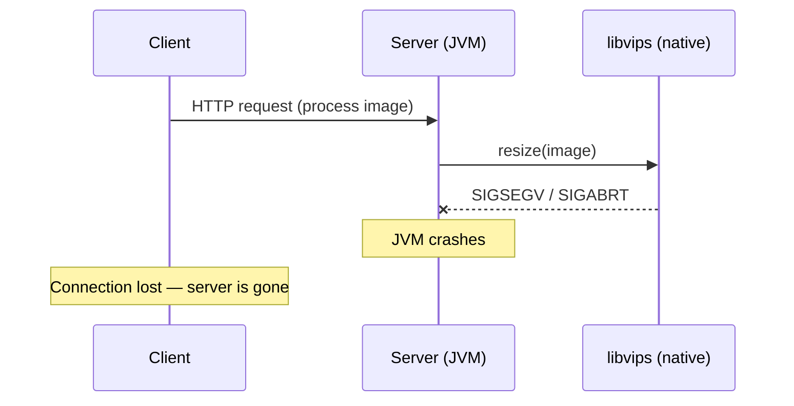
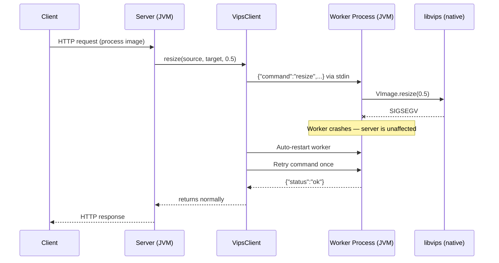
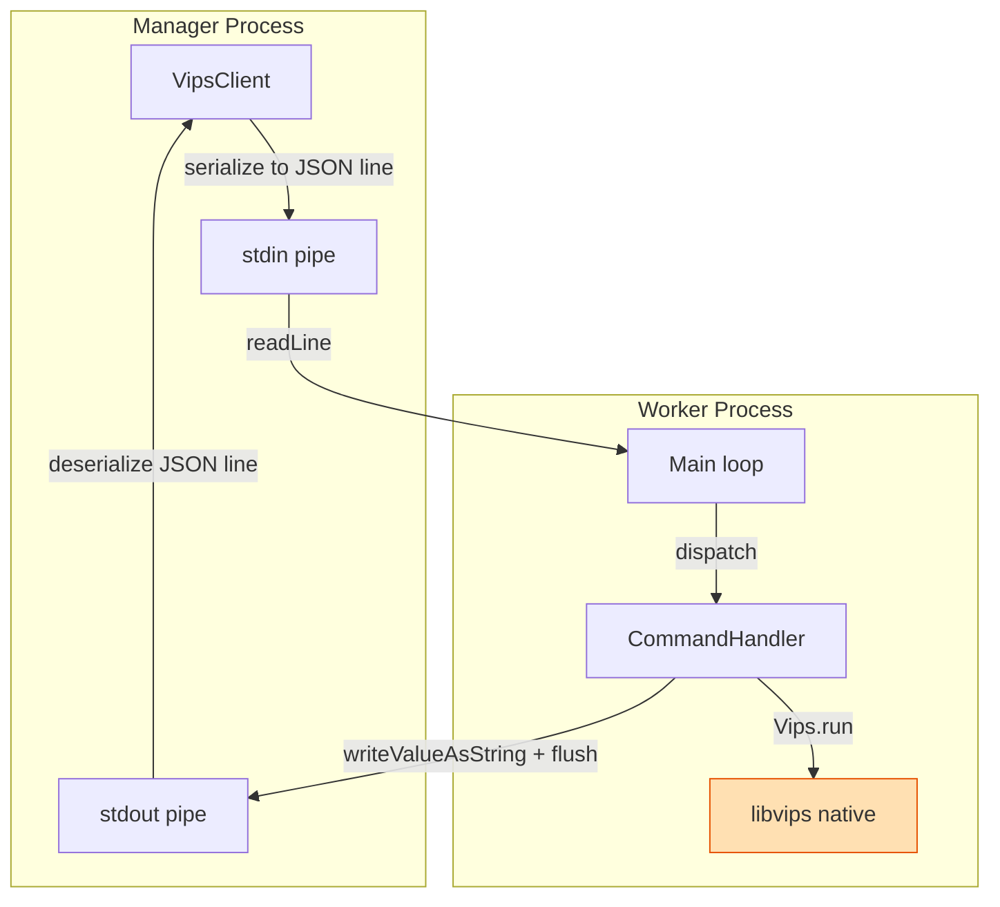

# vips-ipc

Inter-process communication wrapper for [libvips](https://www.libvips.org/) image processing, designed to protect
server applications from native library crashes.

## The Problem: Native Crashes in Server Processes

libvips is a high-performance image processing library written in C. When used from a Java server application via
[vips-ffm](https://github.com/lopcode/vips-ffm) (the Foreign Function & Memory API), all native code runs inside the
same JVM process as the server.

This creates a critical reliability problem:



A segmentation fault, abort signal, or heap corruption inside libvips terminates the entire JVM. Every concurrent
request fails. The server goes down. This is not a hypothetical edge case — broken input files, codec bugs, or
out-of-memory conditions in native libraries can and do trigger such crashes in production.

## The Solution: Isolation via IPC

vips-ipc moves all VIPS operations into a separate worker process. The server communicates with it over **stdin/stdout
using a line-based JSON protocol**. If the worker crashes, only that child process dies — the server process is
completely unaffected.



Key properties of this design:

- **Crash isolation**: A native crash in the worker cannot propagate to the server JVM
- **Auto-restart with retry**: If the worker dies, `VipsClient` automatically spawns a new one and retries the failed
  command once before throwing an exception
- **Thread-safe**: A `ReentrantLock` serializes all commands to the worker — safe to share across threads
- **Self-contained**: The worker JAR is embedded inside the manager JAR as a classpath resource; no external binary or
  installation is required

## Usage

```java
try (VipsClient client = VipsClient.builder().build()) {

  // Scale an image to 50%
  client.resize(
      Path.of("/var/images/input.jpg"),
      Path.of("/var/images/output.jpg"),
      0.5);

  // Create a thumbnail with fixed width (height proportional)
  client.thumbnail(
      Path.of("/var/images/input.jpg"),
      Path.of("/var/images/thumb.jpg"),
      320);
}
```

`VipsClient` implements `AutoCloseable`. Use it in a try-with-resources block or hold a single instance for the
lifetime of your application — both patterns are supported.

### Builder Options

```java
VipsClient client = VipsClient.builder()
    .javaExecutable("/usr/lib/jvm/java-25/bin/java")  // default: current JVM
    .jvmArgs(List.of("-Xmx512m"))                      // default: none
    .jarPath(Path.of("/opt/app/worker.jar"))            // default: embedded JAR
    .commandTimeoutMs(60_000)                           // default: 30 000 ms
    .build();
```

## How it Works

### Fat JAR Embedding

The worker is packaged as a shaded fat JAR during the Maven build. The manager module then copies that JAR into its
own classpath resources under the name `vips-ipc-worker.jar`. At runtime, `VipsClientBuilder` extracts it to a
temporary file and launches it — no separate installation or deployment step is needed.


### Worker Startup

When the first command is sent, `VipsClient` calls `ensureRunning()`, which:

1. Extracts the worker JAR from classpath resources to a temp file (cached for subsequent calls)
2. Spawns a child process: `java [jvmArgs] -jar /tmp/vips-ipc-worker-XXXX.jar`
3. Connects stdin/stdout pipes for the JSON protocol
4. Starts a daemon thread that continuously drains the worker's stderr (required to prevent pipe-buffer blocking)

On `close()`, the client sends a `Shutdown` command, waits up to 5 seconds for a clean exit, then force-kills the
process.

### Communication Protocol

Commands and responses are exchanged as **single JSON lines** over stdin/stdout:

```
Manager → Worker (stdin):
{"command":"resize","source":"/path/input.jpg","target":"/path/output.jpg","scale":0.5}

Worker → Manager (stdout):
{"status":"ok"}
```

On error:

```
Worker → Manager (stdout):
{"status":"error","message":"VipsError: ...", "stackTrace":"..."}
```

Both `Command` and `Response` use Jackson's `@JsonTypeInfo` polymorphic deserialization. The discriminator field
`command` selects the concrete command type; the field `status` selects the response type.



The worker flushes stdout after every response — this is critical to prevent buffering from stalling the manager.

## Project Structure

```
vips-ipc (parent)
├── vips-ipc-share   – shared DTOs: Command/Response sealed interfaces and record implementations
├── vips-ipc-manager – VipsClient and VipsClientBuilder; manages the worker process lifecycle
└── vips-ipc-worker  – Main loop, CommandHandler implementations, libvips calls via vips-ffm
```

## Adding a New Command

1. Add a record implementing `Command` in `vips-ipc-share`:
   ```java
   public record Convert(String source, String target, String format) implements Command {}
   ```
2. Register it in the `@JsonSubTypes` annotation on the `Command` interface:
   ```java
   @JsonSubTypes.Type(value = Convert.class, name = "convert")
   ```
3. Implement `CommandHandler<Convert>` in `vips-ipc-worker`
4. Add the handler to the `switch` in `Main.java`
5. Expose a public method on `VipsClient` in `vips-ipc-manager`

## Building

```bash
mvn clean verify
```

Requires Java 25 and a working libvips installation for the integration tests.
